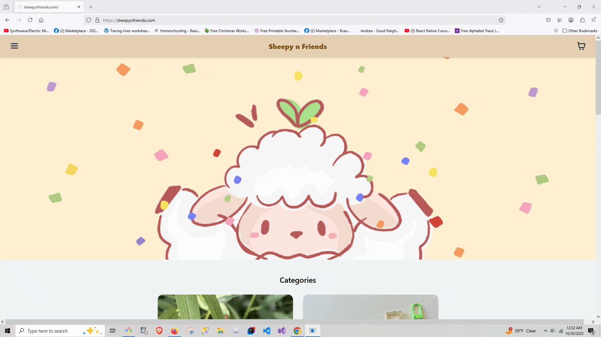

# Sheepy n Friends Ecommerce site
A live site that currently has $6k in revenue and is growing.
Focus on selling Christian hand-made crafts.

Is managed via a live site using Svelte/ JavaScript.
Uses Microsoft Sql for data storage.
Locally hosted using Nginx reverse proxy/ load balancer.
Uses Python Fast API for communication between Frontend -> Backend -> Storage.

## Features:
 
Ability to add and remove appointments  

